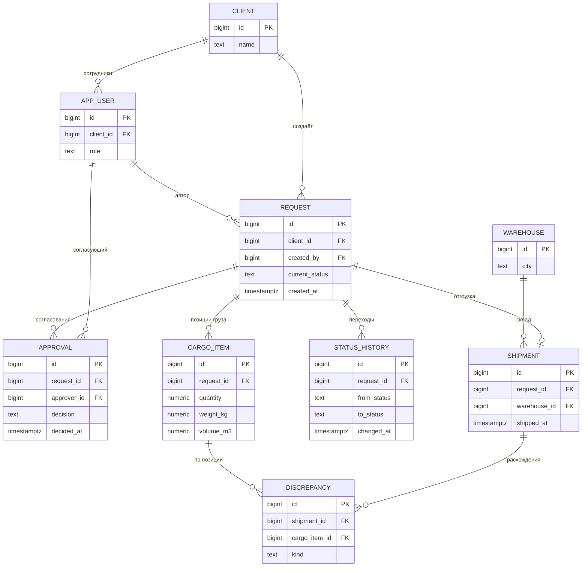

# Модель данных B2B-логистического кабинета

Схема данных и аналитические запросы для процесса обработки логистических заявок: от создания клиентом до закрытия менеджером.

Продолжение кейса [b2b-logistics-request-lifecycle](https://github.com/mamorudreamer/b2b-logistics-request-lifecycle), где описаны процесс в BPMN и жизненный цикл заявки в UML. Здесь та же предметная область положена на структуру данных.

## Ограничения

Модель предметной области, восстановленная по памяти о работе над B2B-личным кабинетом логистической компании в 2023–2024 годах. Реальная схема данных продукта мне недоступна, и эта модель её не воспроизводит.

Запросы написаны под PostgreSQL и приведены как демонстрация подхода. Логика ключевых запросов проверена на синтетических данных; на промышленной базе они не исполнялись.

## Схема

DDL со всеми полями, ограничениями и индексами — в [`schema.sql`](schema.sql).

## Три решения, которые стоит объяснить

**История статусов вынесена в отдельную таблицу, а `current_status` оставлен в заявке.** Это осознанная денормализация. Источник истины — `status_history`: по ней считается время в статусе, возвраты и воронка. Поле `current_status` — кэш для списков и фильтров, иначе каждая строка реестра заявок требовала бы подзапроса за последним переходом. Цена — необходимость держать поле и историю согласованными в одной транзакции.

**Согласование — таблица, а не поле.** Согласующих несколько, и переход в `APPROVED` возможен только когда решения есть у всех и ни одно не отрицательное. Поле `approved_by` такую логику не выражает. Побочная выгода: становится видно, кто именно задерживает согласование, — это запрос 3.

**Расхождение привязано к отгрузке и позиции груза, а не к заявке.** Расходится не заявка целиком, а конкретная позиция по конкретному признаку: количество, вес, объём. Связь с `cargo_item` позволяет считать статистику по характеристикам груза и проверять гипотезу, что тяжёлый и объёмный груз расходится чаще, — это запрос 4.

Отдельно про разделение ответственности: `reported_by` в расхождении — это сотрудник склада, зафиксировавший факт. Решение вернуть заявку принимает менеджер, и оно попадает в `status_history` с его идентификатором. Действие и решение о действии — разные записи.

## Запросы

Полные тексты — в [`queries.sql`](queries.sql).

| № | Вопрос бизнеса | Что показывает |
|---|---|---|
| 1 | Где заявки простаивают дольше всего | Время в каждом статусе: среднее, медиана, p90 |
| 2 | Улучшается ли качество заполнения заявок | Доля заявок с возвратом на доработку по месяцам |
| 3 | Кто задерживает согласование | Просроченные и отклонённые решения по согласующим |
| 4 | Зависят ли расхождения от типа груза | Доля отгрузок с расхождением по классам груза |
| 5 | Какая доля заявок доходит до закрытия | Воронка по когортам создания |

Приёмы: оконная функция `LEAD` для расчёта времени в статусе, `PERCENTILE_CONT` для медианы и p90, агрегаты с `FILTER` вместо `CASE`, `NULLIF` в знаменателях, `BOOL_OR` по истории вместо `current_status` — иначе отменённые заявки выпадают из воронки.

В запросе 1 намеренно оставлено ограничение и описано комментарием: заявки, находящиеся в статусе прямо сейчас, в расчёт не попадают, что смещает оценку вниз. Для оперативного мониторинга нужен отдельный запрос.

## Что осталось за рамками

- Матрица прав: какие переходы статусов доступны каждой роли.
- Версионирование заявки: сохранение состава груза на момент согласования.
- SLA и уведомления: нормативы времени по статусам.
- Партиционирование `status_history` по дате при росте объёма.

## Автор

Александр Кирилов — [github.com/mamorudreamer](https://github.com/mamorudreamer)
